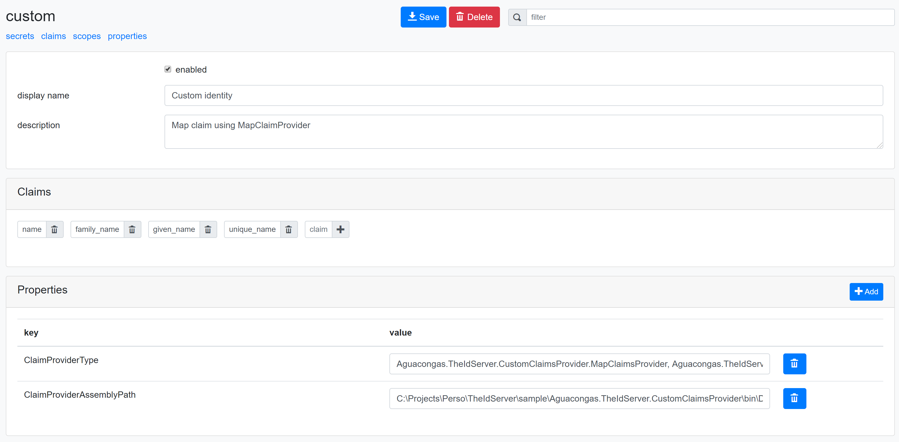

# Claims providers

You can add your custom claims providers to the server. The [`ProfileService`](https://github.com/Aguafrommars/TheIdServer/blob/master/src/IdentityServer/Aguacongas.IdentityServer.Admin/Services/ProfileService.cs) uses claims providers defined in resources properties.

When a client ask for a resource (Identity or API), the [`ProfileService`](https://github.com/Aguafrommars/TheIdServer/blob/master/src/IdentityServer/Aguacongas.IdentityServer.Admin/Services/ProfileService.cs) looks for **ClaimProviderType** key in its properties. If this key is found, it looks for this type's full name in `IProvideClaims` collection registered in the dependencies injection container and call the method  [`ProvideClaims`](https://github.com/Aguafrommars/TheIdServer/blob/master/src/IdentityServer/Aguacongas.IdentityServer/Abstractions/IProvideClaims.cs) with the current context subject, client, caller and properties.

If the provider is not found in DI container and the property **ClaimProviderAssemblyPath** is provided, it load the assembly from this path and create an instance of the provided type.

## Implement

Claims providers must implement [`IProvideClaims`](https://github.com/Aguafrommars/TheIdServer/blob/master/src/IdentityServer/Aguacongas.IdentityServer/Abstractions/IProvideClaims.cs) interface.

**sample**

> The project [sample/Aguacongas.TheIdServer.CustomClaimsProvider](sample/Aguacongas.TheIdServer.CustomClaimsProvider) contains an implementation sample.

```cs
public class MapClaimsProvider: IProvideClaims
{
    public Task<IEnumerable<Claim>> ProvideClaims(ClaimsPrincipal subject, Client client, string caller, Resource resource)
    {
        var defaultOutboundClaimMap = JwtSecurityTokenHandler.DefaultOutboundClaimTypeMap;
        var claims = new List<Claim>(subject.Claims.Count());
        foreach (var claim in subject.Claims)
        {
            if (defaultOutboundClaimMap.TryGetValue(claim.Type, out string toClaimType))
            {
                claims.Add(new Claim(toClaimType, claim.Value, claim.ValueType, claim.Issuer));
            }
        }

        return Task.FromResult(claims as IEnumerable<Claim>);
    }
}
```

If your provider has dependencies, you can register it in the depencies injection container by implementing the `ISetupClaimsProvider` interface.

**sample**

> The project [sample/Aguacongas.TheIdServer.CustomClaimsProvider](sample/Aguacongas.TheIdServer.CustomClaimsProvider) contains an implementation sample.

```cs
public class ClaimsProvidersSetup : ISetupClaimsProvider
{
    public IServiceCollection SetupClaimsProvider(IServiceCollection services, IConfiguration configuration)
    {
        services.AddHttpClient("claims")
            .ConfigureHttpClient(client => client.BaseAddress = new Uri(configuration.GetValue<string>("ClaimsWebServiceUrl")));

        return services.AddTransient<IProvideClaims>(p => new WebServiceClaimsProvider(p.GetRequiredService<IHttpClientFactory>().CreateClient("claims")));
    }
}
```

## Configruation

To register your claims providers in the DI container, add setups classes declarations in the **ClaimsProviderOptions** configuration section.

```json
"ClaimsProviderOptions": [
    {
        "AssemblyPath": "{path to dll containing the setup class}",
        "TypeName": "{Full name of the setup class}"
    }
]
```

**sample**

```json
"ClaimsProviderOptions": [
    {
        "AssemblyPath": "Aguacongas.TheIdServer.CustomClaimsProviders.dll",
        "TypeName": "Aguacongas.TheIdServer.CustomClaimsProviders.ClaimsProvidersSetup"
    }
]
```

In a resource (Identity or API) your client ask for, add the property **ClaimProviderType** with full type name of a class implementing [`IProvideClaims`](https://github.com/Aguafrommars/TheIdServer/blob/master/src/IdentityServer/Aguacongas.IdentityServer/Abstractions/IProvideClaims.cs) interface.

If you do not register your providers in the DI container, add the path to the assembly containing this class in the property **ClaimProviderAssemblyPath**.



