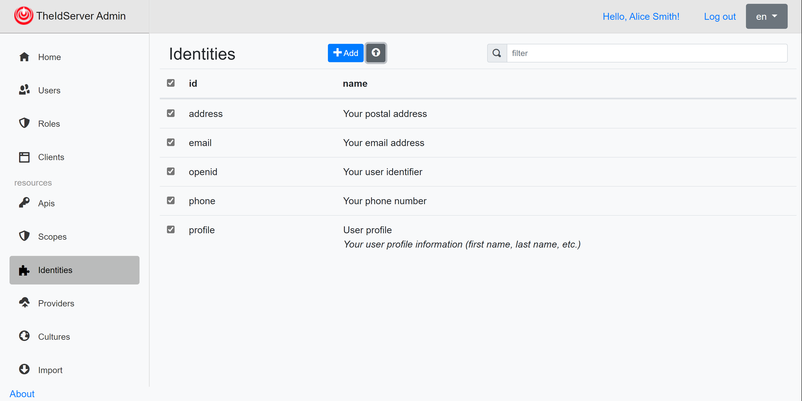
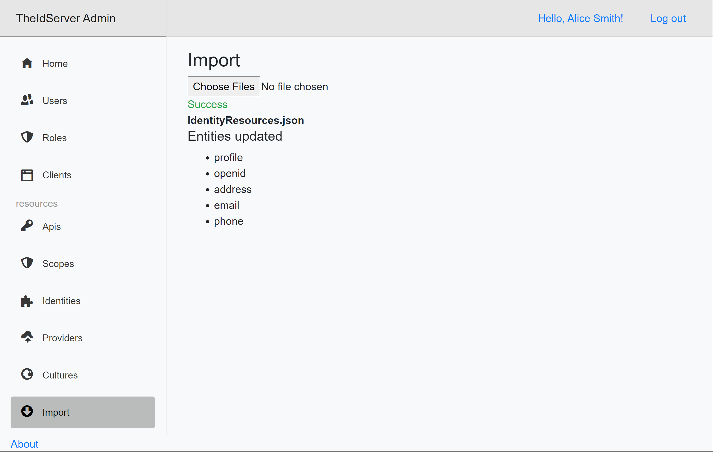

# Export/Import configuration

On each page of the application, the export button  allows you to export the configuration in a json file.

You can import this file in another environment to add or update the configuration.

