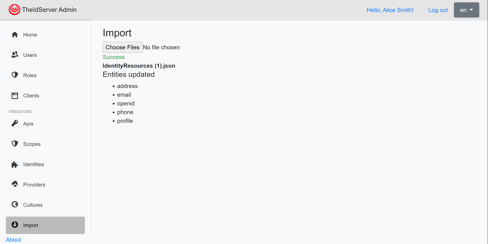

# Export/Import configuration

On each pages of the application the export button  allow you to export the configuration in a json file.

You can import this file in another environment to add or update the configuration.

