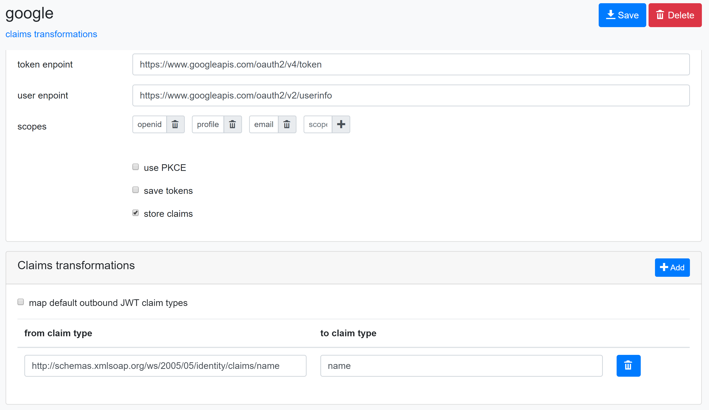

# Extenal claims transformation

The service [`ExternalClaimsTransformer`](src/IdentityServer/Aguacongas.IdentityServer.Admin/Services/ExternalClaimsTransformer.cs) maps claims received from an external provider depending on the claims transformation configuration.  
The service's method `TransformPrincipalAsync` is called on each [`OnTicketReceived`](https://docs.microsoft.com/en-us/dotnet/api/microsoft.aspnetcore.authentication.remoteauthenticationevents.onticketreceived) event.

## Configuration



#### map default outbound JWT claim types

When checked, the check box *map default outbound JWT claim types* configures the [`ExternalClaimsTransformer`](src/IdentityServer/Aguacongas.IdentityServer.Admin/Services/ExternalClaimsTransformer.cs) service to map each claim type defines in the dictionary [`JwtSecurityTokenHandler.DefaultOutboundClaimTypeMap`](https://docs.microsoft.com/en-us/dotnet/api/system.identitymodel.tokens.jwt.jwtsecuritytokenhandler.defaultoutboundclaimtypemap) to their corresponding claim type.

#### from claim type / to claim type

The table *from claim type / to claim type* configures the [`ExternalClaimsTransformer`](src/IdentityServer/Aguacongas.IdentityServer.Admin/Services/ExternalClaimsTransformer.cs) service to map one claim type to another claim type.

> This table configuration takes precedence on [`JwtSecurityTokenHandler.DefaultOutboundClaimTypeMap`](https://docs.microsoft.com/en-us/dotnet/api/system.identitymodel.tokens.jwt.jwtsecuritytokenhandler.defaultoutboundclaimtypemap).

#### store claims

When checked, the check box *store claims* configures the [`ExternalClaimsTransformer`](src/IdentityServer/Aguacongas.IdentityServer.Admin/Services/ExternalClaimsTransformer.cs) service to store claims in [Identity](https://docs.microsoft.com/en-us/aspnet/core/security/authentication/identity?view=aspnetcore-3.1&tabs=visual-studio) user's data.  

> It must be check to allow the [UserInfo Endpoint](https://identityserver4.readthedocs.io/en/latest/endpoints/userinfo.html) and the admin application to read claims from external providers.

### Verification

When claims are stored and mapped, the admin UI display a mapping information in the user's claims section.


## Using the service by code

If you use Nuget packages, you can take advantage of the service  [`ExternalClaimsTransformer`](src/IdentityServer/Aguacongas.IdentityServer.Admin/Services/ExternalClaimsTransformer.cs) by configuring the call to `TransformPrincipalAsync` on each [`OnTicketReceived`](https://docs.microsoft.com/en-us/dotnet/api/microsoft.aspnetcore.authentication.remoteauthenticationevents.onticketreceived) event.


```cs
public void ConfigureServices(IServiceCollection services)
{
    ...
    services.AddTransient<ExternalClaimsTransformer<ApplicationUser>>()
        .AddAuthentication()
        .AddGoogle(options =>
        {
            ...
            options.Events = new OAuthEvents
            {
                OnTicketReceived = OnTicketReceived()
            };
        });
}

private static Func<TicketReceivedContext, Task> OnTicketReceived()
{
    return async context =>
    {
        using var scope = context.HttpContext.RequestServices.CreateScope();
        var transformer = scope.ServiceProvider.GetRequiredService<ExternalClaimsTransformer<ApplicationUser>>();
        context.Principal = await transformer.TransformPrincipalAsync(context.Principal, context.Scheme.Name)
            .ConfigureAwait(false);
    };
}
```