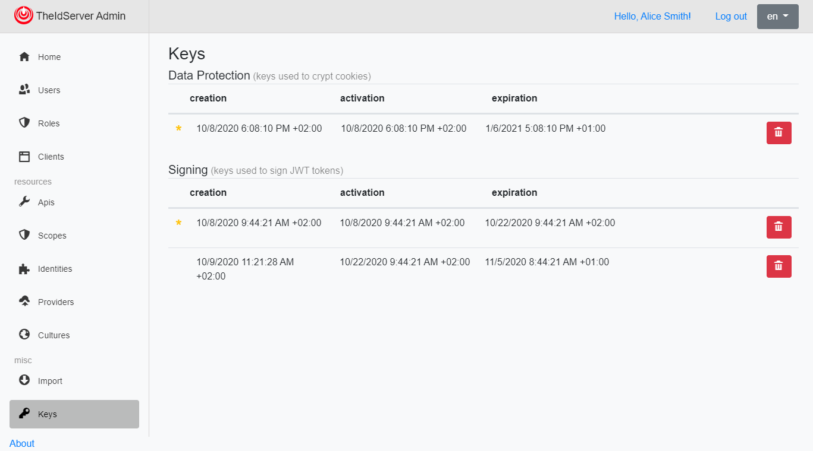
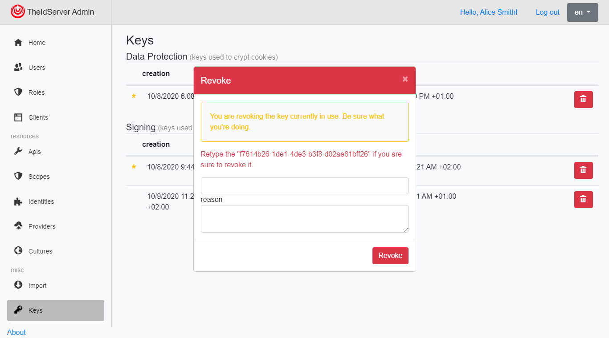

# Manage keys

## Revoke a key

## Additional resources

* [ASP.NET Core Data Protection](https://docs.microsoft.com/en-us/aspnet/core/security/data-protection/introduction?view=aspnetcore-3.1)
* [IdentityServer and Signing Key Rotation](https://brockallen.com/2019/08/09/identityserver-and-signing-key-rotation/)
* [Aguacongas.IdentityServer.KeysRotation](../src/IdentityServer/Aguacongas.IdentityServer.KeysRotation#aguacongasidentityserverkeysrotation)