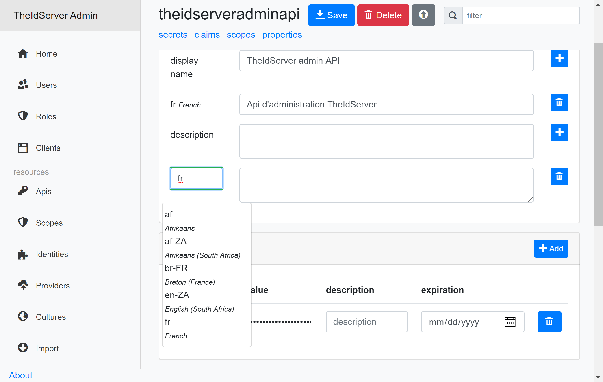

# Localization

Server pages and the admin UI can be localized for cultures you need.

## Cultures

  

The default culture is **en**. When you add a new culture, a language selector appears in the admin UI.

> The server must be restarted to take the new culture in charge.

In the culture page you can translate english string resources used by the server or the application.

  

The application doesn't provide a list of key but instead a warning log is written each time a key is not found for a specific culture.

In the browser console for application resources
  

In the server log for server resources
  

## Clients, APIs and Identities

To localized consents and grants screen, you can define localized strings for names and descriptions of your clients, APIs, API's scopes and identities resources.

  

And this strings will be localized in consents

  

and grants screens.

  

## Application Welcom screen

When the application setting `welcomeContenUrl` = */api/welcomefragment*

```json
"welcomeContenUrl": "/api/welcomefragment"
```

The api'll look for a file named *{EnvironmentName}-welcome-fragment.{CultureName}.html* in the *wwwroot* folder  
and fallback to *{EnvironmentName}-welcome-fragment.html*  
then to *welcome-fragment.{CultureName}.html*  
then to *welcome-fragment.html*

## Culture cookie

Any request to the server containing the query string *culture={CultureName}* set the culture cookie to the desired culture.

  

This allow you to get the culture cookie in your apps.
