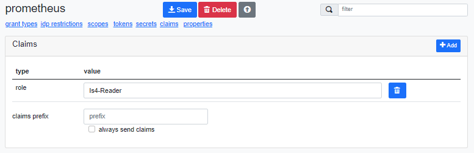

# Configure OpenTelemetry

TheIdServer can export [OpenTelemetry](https://opentelemetry.io/) data.  

## Traces

### Service

The service configuration is used to setup the source name and resource.

```json
{
  "OpenTelemetryOptions": {
    "Trace": {
      "Service": {
          "Name": "TheIdServer.Duende",
          "Version": "4.6.0"
      }
    }
  }
}
```

The `Service` node is deserialized in a [`ServiceOptions`](../src/Aguacongas.TheIdServer/Options/OpenTelemetry/ServiceOptions.cs) instance used in : 

```c#
builder.AddSource(serviceOptions.Name)
  .SetResourceBuilder(ResourceBuilder.CreateDefault().AddService(serviceOptions.Name,
      serviceOptions.Namespace,
      serviceOptions.Version,
      serviceOptions.AutoGenerateServiceInstanceId,
      serviceOptions.InstanceId));
```

### Instrumentations

TheIdServer enables instrumentation for:

- HttpClient
- Incoming requests
- SqlClient
- Redis

Each part can be configurd using the `Instrumentation` node.

#### HttpClient

```json
{
  "OpenTelemetryOptions": {
    "Trace": {
      "Instrumentation": {
        "HttpClient": {
          "RecordException": true,
          "SetHttpFlavor": true        
        }
      }
    }
  }
}
```

`HttpClient` is deserialized into a [`HttpClientInstrumentationOptions`](https://github.com/open-telemetry/opentelemetry-dotnet/blob/main/src/OpenTelemetry.Instrumentation.Http/HttpClientInstrumentationOptions.cs) instance.

#### Incoming requests

```json
{
  "OpenTelemetryOptions": {
    "Trace": {
      "Instrumentation": {
        "AspNetCore": {
          "RecordException": true,
          "EnableGrpcAspNetCoreSupport": true
        }
      }
    }
  }
}
```

`AspNetCore` is deserialized into a [`AspNetCoreInstrumentationOptions`](https://github.com/open-telemetry/opentelemetry-dotnet/blob/main/src/OpenTelemetry.Instrumentation.AspNetCore/AspNetCoreInstrumentationOptions.cs) instance.

#### SqlClient

```json
{
  "OpenTelemetryOptions": {
    "Trace": {
      "Instrumentation": {
        "SqlClient": {
          "RecordException": true,
          "EnableConnectionLevelAttributes": true,
          "SetDbStatementForText": true,
          "SetDbStatementForStoredProcedure": true
        }
      }
    }
  }
}
```

`SqlClient` is deserialized into a [`SqlClientInstrumentationOptions`](https://github.com/open-telemetry/opentelemetry-dotnet/blob/2a97920ff0a603837a1121204824955bba739c57/src/OpenTelemetry.Instrumentation.SqlClient/SqlClientInstrumentationOptions.cs) instance.


#### Redis

To enable the Redis instumentation you need to define the Redis connection string:

```json
{
  "OpenTelemetryOptions": {
    "Trace": {
      "Instrumentation": {
        "Redis": {
          "ConnectionString": "localhost",
          "FlushInterval": "0:0:10",
          "SetVerboseDatabaseStatements": true,
        }
      }
    }
  }
}
```

`Redis` is deserialized into a [`RedisOptions`](../src/Aguacongas.TheIdServer/Options/OpenTelemetry/RedisOptions.cs) instance.


### Exporters

#### Console

To enable the console exporter set `ConsoleEnabled`:

```json
{
  "OpenTelemetryOptions": {
    "Trace": {
      "ConsoleEnabled": true
    }
  }
}
```

#### OTLP endpoint or Collector

To enable the [OTLP endpoint or Collector](https://opentelemetry.io/docs/collector/getting-started/) setup the `OpenTelemetryProtocol` node:

```json
{
  "OpenTelemetryOptions": {
    "Trace": {
      "OpenTelemetryProtocol": {
        "Endpoint": "https://exemple.com", //required
        "ExportProcessorType": "Batch",
        "Protocol": "HttpProtobuf" ,
        "TimeoutMilliseconds": 10000,
        "BatchExportProcessorOptions": {
          "BatchExportProcessorOptions": 2048,
          "ScheduledDelayMilliseconds": 5000,
          "ExporterTimeoutMilliseconds": 30000,
          "MaxExportBatchSize": 512
        }
      }
    }
  }  
}
```

`OpenTelemetryProtocol` is deserialized into a [`OtlpExporterOptions`](https://github.com/open-telemetry/opentelemetry-dotnet/blob/4b3ee96ffc39bc24c3b8377455b2c099bd9da6b0/src/OpenTelemetry.Exporter.OpenTelemetryProtocol/OtlpExporterOptions.cs) instance.

#### Jaeger

To enable the [Jaeger](https://www.jaegertracing.io/) exporter setup the `Jaeger` node:

```json
{
  "OpenTelemetryOptions": {
    "Trace": {
      "Jaeger": {
        "AgentHost": "exemple.com", //required
        "AgentPort": 443 ,
        "ExportProcessorType": "Batch",
        "BatchExportProcessorOptions": {
          "BatchExportProcessorOptions": 2048,
          "ScheduledDelayMilliseconds": 5000,
          "ExporterTimeoutMilliseconds": 30000,
          "MaxExportBatchSize": 512
        }
      }
    }
  }
}
```

`Jaeger` is deserialized into a [`JaegerExporterOptions`](https://github.com/open-telemetry/opentelemetry-dotnet/blob/main/src/OpenTelemetry.Exporter.Jaeger/JaegerExporterOptionsExtensions.cs) instance.

#### Zipkin

To enable [Zipkin](https://zipkin.io/) exporter setup the `Zipkin` node:

```json
{
  "OpenTelemetryOptions": {
    "Trace": {
      "Zipkin": {
        "Endpoint": "https://exemple.com", //required
        "ExportProcessorType": "Batch",
        "MaxPayloadSizeInBytes": 4096,
        "UseShortTraceIds": true,
        "BatchExportProcessorOptions": {
          "BatchExportProcessorOptions": 2048,
          "ScheduledDelayMilliseconds": 5000,
          "ExporterTimeoutMilliseconds": 30000,
          "MaxExportBatchSize": 512
        }
      }
    }
  }
}
```

`Zipkin` is deserialized into a [`ZipkinExporterOptions`](https://github.com/open-telemetry/opentelemetry-dotnet/blob/bc0e8afd96e9051dee328ab9a60bdf896a7709b4/src/OpenTelemetry.Exporter.Zipkin/ZipkinExporterOptions.cs) instance.

#### Honeycomb

To enable [Honeycomb](https://www.honeycomb.io/) exporter setup the `Honeycomb` node:

```json
{
  "OpenTelemetryOptions": {
    "Trace": {
      "Honeycomb": {
        "ApiKey": "my-haneycomb-api-key", //required
        "Dataset": "TheIdServer", //required,
        "TracesApiKey": "my-haneycomb-traces-api-key",
        "MetricsApiKey": "my-haneycomb-metrics-api-key",
        "TracesDataset": "TheIdServer-traces",
        "MetricsDataset": "TheIdServer-metrics",
        "Endpoint": "https://api.honeycomb.io:443",
        "TracesEndpoint": "https://api.honeycomb.io:443",
        "MetricsEndpoint": "https://api.honeycomb.io:443",
        "SampleRate": 1,
        "ServiceName": "TheIdServer",
        "ServiceVersion": "4.6.0",
        "InstrumentHttpClient": true,
        "InstrumentSqlClient": true,
        "InstrumentGrpcClient": true,
        "InstrumentStackExchangeRedisClient": true,
        "MeterNames": [
          "TheIdServer"
        ]
      }
    }
  }
}
```

`Honeycomb` is deserialized into a [`HoneycombOptions`](https://docs.honeycomb.io/getting-data-in/opentelemetry/dotnet-distro/) instance.

## Metrics

TheIdServer expose incoming requests and HttpClient metrics.

### Exporters

#### Console

To enable the console exporter set `Console` node:

```json
{
  "OpenTelemetryOptions": {
    "Metrics": {
      "Console": {
        "Targets": "Console",
        "MetricReaderType": "Cumulative",
        "MetricReaderType": "Manual",
        "PeriodicExportingMetricReaderOptions": {
          "ExportIntervalMilliseconds": 60000,
          "ExportTimeoutMilliseconds": 60000
        }
      }
    }
  }
}
```

`Console` is deserialized into a [`ConsoleOptions`](../src/Aguacongas.TheIdServer/Options/OpenTelemetry/ConsoleOptions.cs) instance.

#### OTLP endpoint or Collector

To enable the [OTLP endpoint or Collector](https://opentelemetry.io/docs/collector/getting-started/) setup the `OpenTelemetryProtocol` node:

```json
{
  "OpenTelemetryOptions": {
    "Metrics": {
      "OpenTelemetryProtocol": {
        "Endpoint": "https://exemple.com", //required
        "ExportProcessorType": "Batch",
        "Protocol": "HttpProtobuf" ,
        "TimeoutMilliseconds": 10000,
        "BatchExportProcessorOptions": {
          "BatchExportProcessorOptions": 2048,
          "ScheduledDelayMilliseconds": 5000,
          "ExporterTimeoutMilliseconds": 30000,
          "MaxExportBatchSize": 512
        }
      }
    }
  }  
}
```

`OpenTelemetryProtocol` is deserialized into a [`OtlpExporterOptions`](https://github.com/open-telemetry/opentelemetry-dotnet/blob/4b3ee96ffc39bc24c3b8377455b2c099bd9da6b0/src/OpenTelemetry.Exporter.OpenTelemetryProtocol/OtlpExporterOptions.cs) instance.


#### Prometheus

To enable the [Prometheus](https://prometheus.io/) exporter set `Prometheus` node:

```json
{
  "OpenTelemetryOptions": {
    "Metrics": {
      "Prometheus": {
        "Protected": false,
        "StartHttpListener": false,
        "HttpListenerPrefixes": [
          "http://localhost:9090"
        ],
        "ScrapeEndpointPath": "/metrics",
        "ScrapeResponseCacheDurationMilliseconds": 10000
      }
    }
  }
}
```

`Prometheus` is deserialized into a [`PrometheusOptions`](../src/Aguacongas.TheIdServer/Options/OpenTelemetry/PrometheusOptions.cs) instance.

You can protect the metrics endpoint if you don't want it be accessible to anonimous user. 

```json
{
  "OpenTelemetryOptions": {
    "Metrics": {
      "Prometheus": {
        "Protected": true,
      }
    }
  }
}
```

When protected the metirc endpoint can be accessed if the user has the role **Is4-Reader**. Setup a client_credential client with a claim of type = role and value = Is4-Reader you'll use in the prometheus job's oauth2 configuration.



Your prometheus.yaml can look like :

```yaml
scrape_configs:
- job_name: "theidserver"
  scheme: "https"
  oauth2:
    client_id: "prometheus"
    client_secret: "your.prometheus-client-secret"
    token_url: "https://theidserver.myorg.com/connect/token"
    scopes: 
    - "theidservertokenapi"
  static_configs:
  - targets:
    - "theidserver.myorg.com"
```

#### Honeycomb

To enable [Honeycomb](https://www.honeycomb.io/) exporter setup the `Honeycomb` node:

```json
{
  "OpenTelemetryOptions": {
    "Metrics": {
      "Honeycomb": {
        "ApiKey": "my-haneycomb-api-key", //required
        "Dataset": "TheIdServer", //required,
        "TracesApiKey": "my-haneycomb-traces-api-key",
        "MetricsApiKey": "my-haneycomb-metrics-api-key",
        "TracesDataset": "TheIdServer-traces",
        "MetricsDataset": "TheIdServer-metrics",
        "Endpoint": "https://api.honeycomb.io:443",
        "TracesEndpoint": "https://api.honeycomb.io:443",
        "MetricsEndpoint": "https://api.honeycomb.io:443",
        "SampleRate": 1,
        "ServiceName": "TheIdServer",
        "ServiceVersion": "4.6.0",
        "InstrumentHttpClient": true,
        "InstrumentSqlClient": true,
        "InstrumentGrpcClient": true,
        "InstrumentStackExchangeRedisClient": true,
        "MeterNames": [
          "TheIdServer"
        ]
      }
    }
  }
}
```