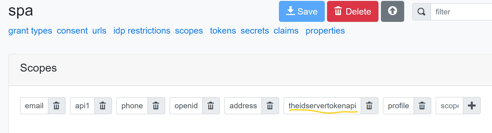
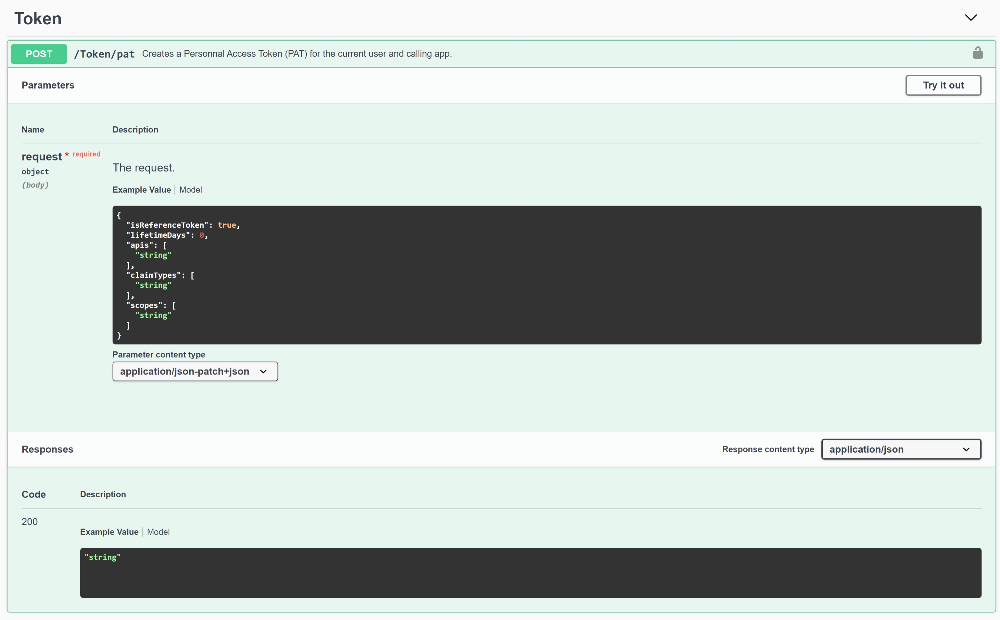

# Create Personal Access Token (PAT)

The API */api/token/pat* can be used to create a Personal Access Token (PAT) for the calling client and the current user.  
The client must has access to the scope **theidservertokenapi** to call this API.



The API takes a json payload contening the type PAT lifetime in days, if it's a reference token, the list of API the client want to create a PAT, the list of claim and the list of scope to include in the PAT, and return the PAT.  
The client must have access to all scopes and APIs it request. Claims are copied from the token used to call the API.



The sample [Aguacongas.TheIdentityServer.SpaSample](../sample/Aguacongas.TheIdentityServer.SpaSample/Pages/PersonalAccessToken.razor) contains an exemple of code to request a PAT.

```cs
var httpClient = _httpClientFactory.CreateClient("TokenApi");

var response = await httpClient.PostAsJsonAsync("api/token/pat", new
{
    IsReferenceToken = IsReferenceToken,
    LifetimeDays = 1,
    Apis = new []
    {
        "api1"
    },
    Scopes = new []
    {
        "api1"
    }
}, default);

Token = await JsonSerializer.DeserializeAsync<string>(await response.Content.ReadAsStreamAsync());
```