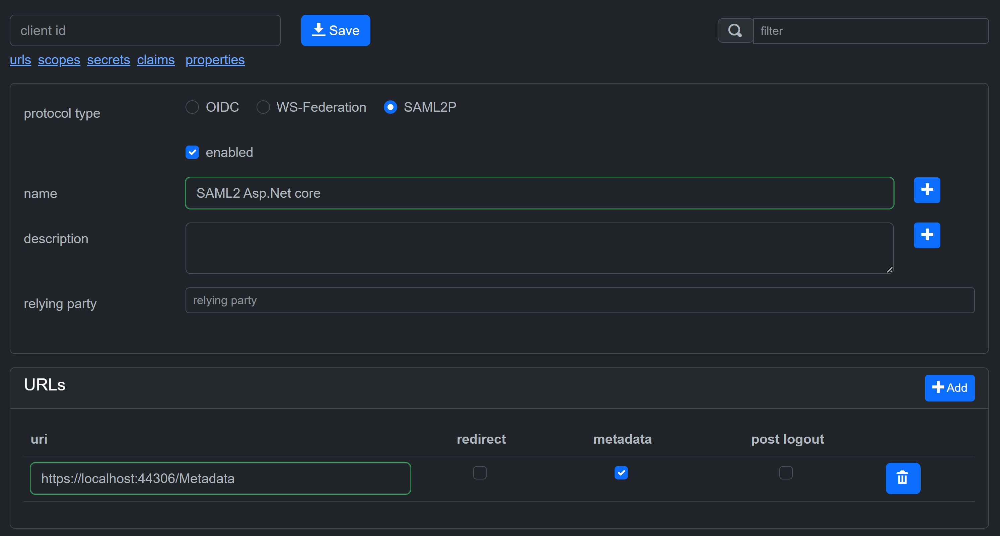

# Configure a SAML 2.0 client

The client id is the issuer.

## Encryption certificate, signature algorithm, name id format

Associate your client with relying party to configure an encryption certificate, a signature algorithm and/or the name id format.

## ACS Artifact

Add the property *UseAcsArtifact* with value *true* to use ACS artifact.

