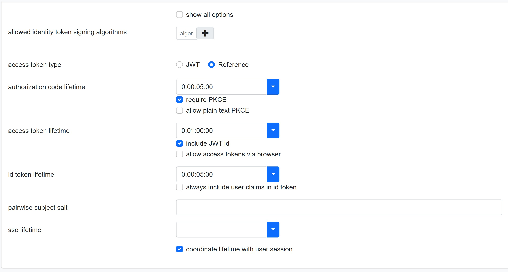
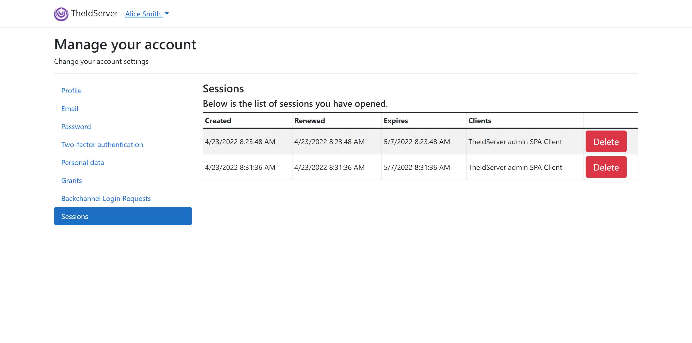
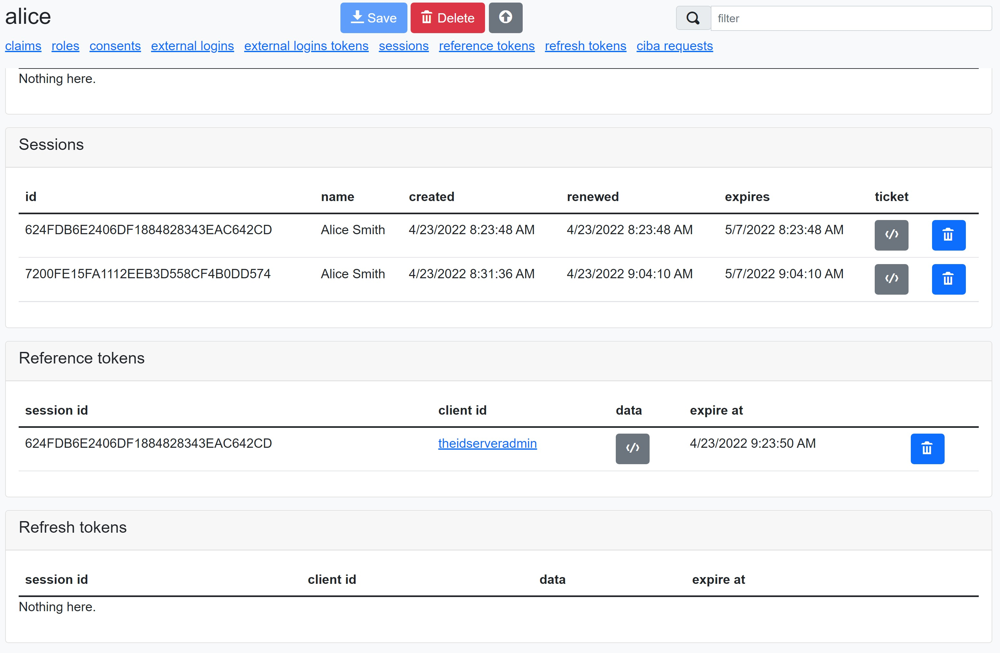

# Server-Side sessions

Since version 4.7.0 the Duende version implements [Server-Side sessions](https://docs.duendesoftware.com/identityserver/v6/ui/server_side_sessions/).

## Configuration

Server-Side sessions must be enabled by settings *IdentityServerOptions:EnableServerSideSession*

```json
"IdentityServerOptions": {
    "EnableServerSideSession": true,
    "ServerSideSessions": {
      "UserDisplayNameClaimType": "name",
      "RemoveExpiredSessions": true,
      "ExpiredSessionsTriggerBackchannelLogout": true,
      "RemoveExpiredSessionsFrequency": "00:10:00",
      "RemoveExpiredSessionsBatchSize": 100
    },
    "Authentication": {
      "CoordinateClientLifetimesWithUserSession": false
    }
```

*IdentityServerOptions:ServerSideSessions* configures server-side sessions behavior.

See [Server-side Sessions options](https://docs.duendesoftware.com/identityserver/v6/reference/options/#server-side-sessions).

### Clients

The *coordinate lifetime with user session* check box in client page token section has been added to manage session inactivity



Sess [Inactivity Timeout](https://docs.duendesoftware.com/identityserver/v6/ui/server_side_sessions/inactivity_timeout/)

## Session management

### Users

Users can manage theirs sessions on **/Identity/Account/Manage/Sessions** page.



### Administrators

Administrators can manage users sessions on the user admin page.



## Additional resources

[Server-Side sessions](https://docs.duendesoftware.com/identityserver/v6/ui/server_side_sessions/)