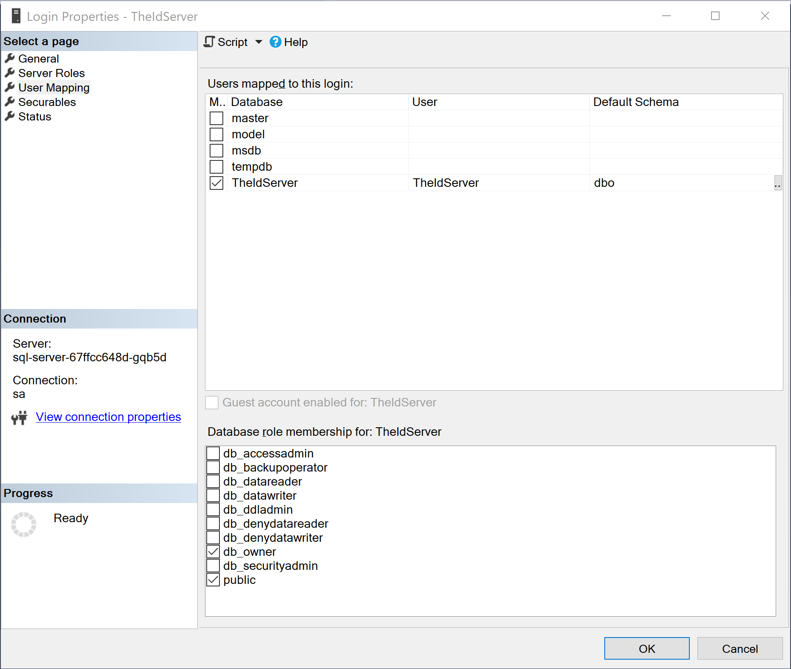

# Kubernetes sample

This folder contains yaml file to setup a complete solution in kubernetes.
It installs:

* a redis server
* a SqlServer server
* a Seq server
* a TheIdServer private servers farm
* a TheIdServer public servers farm

By default all files create entities in **theidserver** namespace.

## Setup

### Certificates

1. Generate files

You need first to generate certificates

* *tls-private.pfx* to setup HTTPS on Kestrel for the private farm.
* *tls-public.pfx* to setup HTTPS on Kestrel for the public farm.
* *theidserver.pfx* to sign JWT tokens

[You can generate pfx using openssl](https://www.ssl.com/how-to/create-a-pfx-p12-certificate-file-using-openssl/).  
Don't forget to save password

2. Certificates persitent volume claim

Create the persitent volume claim to store certificates

```bash
kubectl -f TheIdServer-private-certificates-volume.yaml
```

3. Certificates files

Copy *.pfx* generated at step 1 in the volume create at step 2.

To get the volume path run:

```bash
> kubectl describe pvc certificates --namespace=theidserver

Name:          certificates
Namespace:     theidserver
StorageClass:  hostpath
Status:        Bound
Volume:        pvc-8f4e2ddf-3db9-4fad-bef1-a23ae760ad62
Labels:        <none>
```

Then with the Volume name return run :

```bash
❯ kubectl describe pv pvc-8f4e2ddf-3db9-4fad-bef1-a23ae760ad62

Name:            pvc-8f4e2ddf-3db9-4fad-bef1-a23ae760ad62
Labels:          <none>
Annotations:     docker.io/hostpath: /var/lib/k8s-pvs/certificates/pvc-8f4e2ddf-3db9-4fad-bef1-a23ae760ad62
                 pv.kubernetes.io/provisioned-by: docker.io/hostpath
Finalizers:      [kubernetes.io/pv-protection]
StorageClass:    hostpath
Status:          Bound
Claim:           theidserver/certificates
Reclaim Policy:  Delete
Access Modes:    RWO
VolumeMode:      Filesystem
Capacity:        1Mi
Node Affinity:   <none>
Message:
Source:
    Type:          HostPath (bare host directory volume)
    Path:          /var/lib/k8s-pvs/certificates/pvc-8f4e2ddf-3db9-4fad-bef1-a23ae760ad62
    HostPathType:
Events:            <none>
```

> If you use Kubernetes with Docker Desktop for Windows */var/lib/k8s-pvs* is mapped to */mnt/wsl/docker-desktop-data/data/k8s-pvs* of your WSL machine.


### Database

You need to create the SqlServer database.

1. SA password

Create a secret to store the SqlServer SA password.  

* Update *SqlServer-secret.yaml* with your base64 SA password

```yaml
apiVersion: v1
kind: Secret
metadata:
    name: sql-server
    namespace: theidserver
data:
  sa-password: IKDNE9nd= # replace by your base64 encoded password here
type: Opaque
```

* Apply the file

```
kubectl apply -f SqlServer-secret.yaml
```

2. Deploy the server

* Create the persitent volume claim for SqlServer

```bash
kubectl -f SqlServer-volume.yaml
```

* Create the deployment

```bash
kubectl -f SqlServer-deployment.yaml
```

* Create the network service

```bash
kubectl -f SqlServer-service.yaml
```

3. Create the database

Using Microsoft SQL Server Management Studio or the tool of your choice.

* Create a dabase named *TheIdServer*
* Create a login named *TheIdServer* and map it to *TheIdServer* database db_owner  


### Redis

* Create the deployment

```bash
kubectl -f Redis-deployment.yaml
```

* Create the network service

```bash
kubectl -f Redis-service.yaml
```

### Seq

* Create the persitent volume claim for Seq

```bash
kubectl -f Seq-volume.yaml
```

* Create the deployment

```bash
kubectl -f Seq-deployment.yaml
```

* Create the network service

```bash
kubectl -f Seq-service.yaml
```

### Private farm

1. Connection string

Create a secret to store the SqlServer connection string.  

* Update *TheIdServer-private-connectionstring.yaml* with your base64 connection string. The connection string should be like *Data Source=sql-server;Initial Catalog=TheIdServer;User Id=TheIdServer;Password={your pwd}*

```yaml
apiVersion: v1
kind: Secret
metadata:
  name: theideserver-connectionstring
  namespace: theidserver
data:
  ConnectionString: RGF0YSBTb3VyY2U9c3FsLXNnZlcjtJbml0aWFsIENhdGFsb2GhlSWRTZXJ2Z7VXNlciBJZD1UaGFNlcnZlcjtQYXNzd29yZD1KdWluLTIwMjA= # replace with your SqlServer connection string
type: Opaque
```

* Apply the file

```
kubectl apply -f TheIdServer-private-connectionstring.yaml
```

2. Certificates passwords

Create a secret to store certificates files passwords.  

* Update *TheIdServer-private-secrets.yaml* with your base64 encoded passwords

```yaml
kind: Secret
apiVersion: v1
metadata:
  name: theidserver-secrets
  namespace: theidserver
data:
  sign-key: VjZW1icmjAxOQ== # replace by your base64 encoded password for theidserver.pfx
  tls.pwd: d1YS0xTcx # replace by your base64 encoded password for tls-private.pfx
```

* Apply the file

```
kubectl apply -f TheIdServer-private-secrets.yaml
```

3. Deploy the farm

