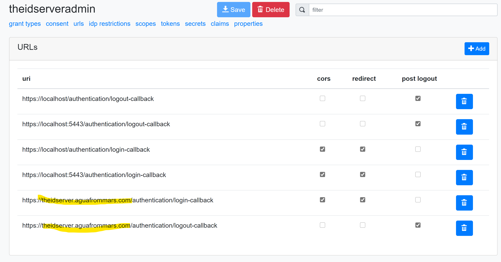

# Kubernetes sample

This folder contains a series of YAML file that demonstrates how to set up a complete solution in Kubernetes.
It deploys the following components:

* a Redis server
* a Microsoft SQL Server server
* a Seq server
* a TheIdServer private servers farm
* a TheIdServer public servers farm

By default, all files create entities in **theidserver** namespace.

## Setup

### Certificates

1. Generate files

First, you will need to generate the required certificates.

* *tls-private.pfx* to setup HTTPS on Kestrel for the private farm.
* *tls-public.pfx* to setup HTTPS on Kestrel for the public farm.
* *theidserver.pfx* to sign JWT tokens

[You can generate pfx using OpenSSL](https://www.ssl.com/how-to/create-a-pfx-p12-certificate-file-using-openssl/).  
Don't forget to save your password.

2. Certificates persistent volume claim

Create a persistent volume claim to store certificates.

```bash
kubectl apply -f TheIdServer-certificates-volume.yaml
```

3. Certificates files

Copy the *.pfx* generated at step 1 in the volume created at step 2.

To get the volume path run:

```bash
> kubectl describe pvc certificates --namespace=theidserver

Name:          certificates
Namespace:     theidserver
StorageClass:  hostpath
Status:        Bound
Volume:        pvc-8f4e2ddf-3db9-4fad-bef1-a23ae760ad62
Labels:        <none>
```

Then with the Volume name return run :

```bash
❯ kubectl describe pv pvc-8f4e2ddf-3db9-4fad-bef1-a23ae760ad62

Name:            pvc-8f4e2ddf-3db9-4fad-bef1-a23ae760ad62
Labels:          <none>
Annotations:     docker.io/hostpath: /var/lib/k8s-pvs/certificates/pvc-8f4e2ddf-3db9-4fad-bef1-a23ae760ad62
                 pv.kubernetes.io/provisioned-by: docker.io/hostpath
Finalizers:      [kubernetes.io/pv-protection]
StorageClass:    hostpath
Status:          Bound
Claim:           theidserver/certificates
Reclaim Policy:  Delete
Access Modes:    RWO
VolumeMode:      Filesystem
Capacity:        1Mi
Node Affinity:   <none>
Message:
Source:
    Type:          HostPath (bare host directory volume)
    Path:          /var/lib/k8s-pvs/certificates/pvc-8f4e2ddf-3db9-4fad-bef1-a23ae760ad62
    HostPathType:
Events:            <none>
```

> If you use Kubernetes with Docker Desktop for Windows */var/lib/k8s-pvs* is mapped to */mnt/wsl/docker-desktop-data/data/k8s-pvs* of your WSL machine.  
From Windows, you can access to the WSL filesystem through *\\\\wsl$".


### Database

You need to create the  SQL Server database.

1. SA password

Create a secret to store the SQL Server SA password.  

* Update *SqlServer-secret.yaml* with your base64 SA password.

```yaml
apiVersion: v1
kind: Secret
metadata:
    name: sql-server
    namespace: theidserver
data:
  sa-password: IKDNE9nd= # replace by your base64 encoded password here
type: Opaque
```

* Apply the file

```
kubectl apply -f SqlServer-secret.yaml
```

2. Deploy the server

* Create a persistent volume claim for SQL Server

```bash
kubectl -f SqlServer-volume.yaml
```

* Create the deployment

```bash
kubectl -f SqlServer-deployment.yaml
```

* Create the network service

```bash
kubectl -f SqlServer-service.yaml
```

3. Create a database

Use Microsoft SQL Server Management Studio or the tool of your choice to create the database.

* Create a database named *TheIdServer*
* Create a login named *TheIdServer* and map it to *TheIdServer* database db_owner  


### Redis

* Create the deployment

```bash
kubectl -f Redis-deployment.yaml
```

* Create the network service

```bash
kubectl -f Redis-service.yaml
```

### Seq

* Create a persistent volume claim for Seq

```bash
kubectl -f Seq-volume.yaml
```

* Create the deployment

```bash
kubectl -f Seq-deployment.yaml
```

* Create the network service

```bash
kubectl -f Seq-service.yaml
```

### Private farm

1. Connection string

Create a secret to store the SqlServer connection string.  

* Update *TheIdServer-private-connectionstring.yaml* with your base64 connection string. The connection string should resemble *Data Source=sql-server;Initial Catalog=TheIdServer;User Id=TheIdServer;Password={your pwd}*

```yaml
apiVersion: v1
kind: Secret
metadata:
  name: theideserver-connectionstring
  namespace: theidserver
data:
  ConnectionString: RGF0YSBTb3VyY2U9c3FsLXNnZlcjtJbml0aWFsIENhdGFsb2GhlSWRTZXJ2Z7VXNlciBJZD1UaGFNlcnZlcjtQYXNzd29yZD1KdWluLTIwMjA= # replace with your SqlServer connection string
type: Opaque
```

* Apply the file

```
kubectl apply -f TheIdServer-private-connectionstring.yaml
```

2. Certificates passwords

Create a secret to store certificates files passwords.  

* Update *TheIdServer-private-secrets.yaml* with your base64 encoded passwords.

```yaml
kind: Secret
apiVersion: v1
metadata:
  name: theidserver-private-secrets
  namespace: theidserver
data:
  sign-key: VjZW1icmjAxOQ== # replace by your base64 encoded password for theidserver.pfx
  tls.pwd: d1YS0xTcx # replace by your base64 encoded password for tls-private.pfx
```

* Apply the file

```
kubectl apply -f TheIdServer-private-secrets.yaml
```

3. Configure the admin app

Create a persistent volume claim to store the configuration files for the admin application.

```
kubectl apply -f TheIdServer-config-volume.yaml
```

Copy [admin-appsettings.Private.json](admin-appsettings.Private.json) file in the volume like you did for certificates.  
At startup, this file is copied in *wwwroot/appsetting.json* to replace the default admin application's configuration file.


4. Deploy the farm

* Create the config map  
The config map stores the environment variables configuration.

```bash
kubectl apply -f TheIdServer-private-configmap.yaml
```

* Create the deployment

```bash
kubectl apply -f TheIdServer-private-deployment.yaml
```

* Create the network service

```bash
kubectl apply -f TheIdServer-private-service.yaml
```

5. Test the deployment

In a browser, navigate to https://localhost:5443.  
You should be able to log with *alice* or *bob* (password: Pass123$).    

### Public farm

1. Certificates passwords

Create a secret to store the passwords for the certificates.  

* Update *TheIdServer-public-secrets.yaml* with your base64 encoded passwords.

```yaml
kind: Secret
apiVersion: v1
metadata:
  name: theidserver-public-secrets
  namespace: theidserver
data:
  sign-key: VjZW1icmjAxOQ== # replace by your base64 encoded password for theidserver.pfx
  tls.pwd: d1YS0xTcx # replace by your base64 encoded password for tls-private.pfx
```

* Apply the file

```
kubectl apply -f TheIdServer-public-secrets.yaml
```

2. Configure the admin application

Copy [admin-appsettings.Public.json](admin-appsettings.Public.json) file in the config volume like you did for the private farm.  
At startup, this file is copied in *wwwroot/appsetting.json* to replace the default admin application's configuration file.

3. Deploy the farm

* Create the config map  
The config map stores the environment variables configuration.

```bash
kubectl apply -f TheIdServer-public-configmap.yaml
```

* Create the deployment

```bash
kubectl apply -f TheIdServer-public-deployment.yaml
```

* Create the network service

```bash
kubectl apply -f TheIdServer-public-service.yaml
```

* Create the ingress

```bash
kubectl apply -f TheIdServer-ingress-service.yaml
```

4. Test the deployment

* Configure your host to route *theidserver.aguafrommars.com* to your localhost.

```
127.0.0.1 theidserver.aguafrommars.com
```

* Add the login and logout URLs to the client *theidserveradmin* using the private farm.



In a browser, navigate to https://theidserver.aguafrommars.com.  
You should be able to log with *alice* or *bob* (password: Pass123$).    

### Security

[Network-policies.yaml](Network-policies.yaml) contains the following rules:

* db role accepts requests from backend only
* log role accepts requests from backend and frontend
* backend accepts requests from frontend only

The SqlServer is in the db role.  
The Seq server is in the log role.  
The private farm is in the backend role.  
The public farm is in the frontend role.

So the public farm cannot access to the SqlServer db but to the Seq server.

To apply those policies launch:

```bash
kubectl apply -f Network-policies.yaml
```