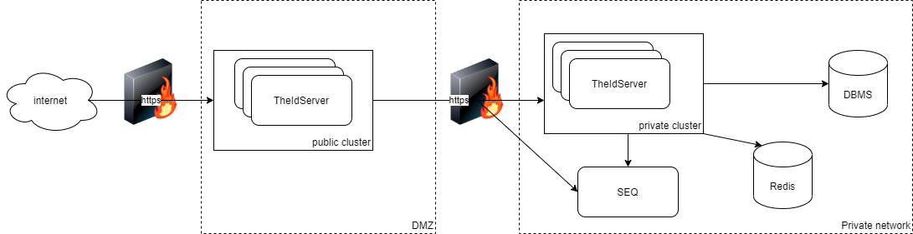

# TheIdServer Web Server project

The server obtains configuration from *appsettings.json*, *appsettings.{Environment}.json*, command-line arguments, or environment variables.

Read [Configuration in ASP.NET Core](https://docs.microsoft.com/en-us/aspnet/core/fundamentals/configuration/?view=aspnetcore-3.1) for more information.

## Installation

### From Docker

A [server's Linux image](https://hub.docker.com/r/aguacongas/theidserver) is available on Docker Hub.

[*sample/MultiTiers/Aguacongas.TheIdServer.Private/Dockerfile-private*](../../sample/MultiTiers/Aguacongas.TheIdServer.Private/Dockerfile-private) demonstrates how to create an image from the [server image](https://hub.docker.com/r/aguacongas/theidserver) to run a private Linux server container.

[*sample/MultiTiers/Aguacongas.TheIdServer.Public/Dockerfile-public*](../../sample/MultiTiers/Aguacongas.TheIdServer.Public/Dockerfile-public) illustrates how to create an image from the [server image](https://hub.docker.com/r/aguacongas/theidserver) to run a public Linux server container.

Read [Hosting ASP.NET Core images with Docker over HTTPS](https://docs.microsoft.com/en-us/aspnet/core/security/docker-https?view=aspnetcore-3.1) to set up the HTTPS certificate.

#### Kubernetes sample

[/sample/Kubernetes/README.md](/sample/Kubernetes/README.md) contains a sample to set up a solution with Kubernetes.

### From Github Release

Choose your release in the [list of releases](https://github.com/Aguafrommars/TheIdServer/releases) and download the server zip.   
Unzip in the destination of your choice. Unzip in the destination of your choice. As with any ASP.NET Core web site, it can run in IIS or as a stand-alone server using your chosen platform.

Read [Host and deploy ASP.NET Core](https://docs.microsoft.com/en-us/aspnet/core/host-and-deploy/?view=aspnetcore-3.1) for more information.

### From NuGet Packages

If you need more customization, you can use published NuGet packages.
[sample/MultiTiers](sample/MultiTiers) contains a sample to build server and API from NuGet packages.

## Configure data protection

[Data protection](../../doc/DATA_PROTECTION.md) provides details on data protection configuration.

## Configure site

The site name is defined by *SiteOptions:TheIdServer*.

```json
"SiteOptions": {
  "Name": "TheIdServer"
}
```

The site stylecheets are *wwwroot/lib/bootstrap/css/bootstrap.css* and *wwwroot/css/site.min.css*.  
The site logo is *wwwroot/logo.png*.  
And the favicon is *wwwroot/favicon.ico*.

By replacing those files you can redefined the site style by yours.

## Configure IdentityServer4

The section **IdentityServerOptions** is binded to the class [`IdentityServer4.Configuration.IdentityServerOptions`](http://docs.identityserver.io/en/latest/reference/options.html).  
So you can set any IdentityServer4 options you want from configuration

```json
"IdentityServerOptions": {
  "Events": {
    "RaiseErrorEvents": true,
    "RaiseInformationEvents": true,
    "RaiseFailureEvents": true,
    "RaiseSuccessEvents": true
  },
  "Endpoints": {
    "EnableJwtRequestUri": true
  }
}
```

## Configure stores

### Using Entity Framework Core

The server supports *SqlServer*, *Sqlite*, *MySql*, *PostgreSQL*, *Oracle*, and *InMemory* databases.  
Use **DbType** to the define the database engine.

```json
"DbType": "SqlServer"
```

And **ConnectionStrings:DefaultConnection** to define the connection string.

```json
"ConnectionStrings": {
  "DefaultConnection": "Data Source=(LocalDb)\\MSSQLLocalDB;database=TheIdServer;trusted_connection=yes;"
}
```

> A [devart dotConnect for Oracle](https://www.devart.com/dotconnect/oracle/) license is a requirement for Oracle.

### Using the API



If you don't want to expose a database with your server, you can set up a second server on a private network accessing the database and use this private server API to access data.

```json
"Proxy": true,
"PrivateServerAuthentication": {
  "Authority": "https://theidserverprivate",
  "ApiUrl": "https://theidserverprivate/api",
  "ClientId": "public-server",
  "ClientSecret": "84137599-13d6-469c-9376-9e372dd2c1bd",
  "Scope": "theidserveradminapi",
  "HttpClientName": "is4"
},
"SignalR": {
  "HubUrl": "https://theidserverprivate/providerhub"
  "HubOptions": {
    "EnableDetailedErrors": true
  },
  "UseMessagePack": true
}
```

#### Proxy

Start the server with proxy mode enabled.

#### PrivateServerAuthentication

Defines how to authenticate the public server on private server API.

#### SignalR

Defines the [SignalR client](https://docs.microsoft.com/en-us/aspnet/core/signalr/dotnet-client?view=aspnetcore-3.1&tabs=visual-studio) configuration.  
This client is used to update the external provider configuration of a running instance. When an external provider configuration changes, the API sends a SignalR notification to inform other running instances.  

For more information, read [Load balancing scenario](https://github.com/Aguafrommars/DymamicAuthProviders/wiki/Load-balancing-scenario).

The SignalR hub accepts requests at */providerhub* and supports the [MessagePack](https://msgpack.org/index.html) protocol.

For more information, read [Use MessagePack Hub Protocol in SignalR for ASP.NET Core](https://docs.microsoft.com/en-us/aspnet/core/signalr/messagepackhubprotocol?view=aspnetcore-3.1).

### Database migration and data seeding

Starting the server with the **/seed** command-line argument creates the database with initial data. Alternatively, configure the server with the following to create a database with initial users, protected resources, identity resources, and clients.

```json
"Migrate": true,
"Seed": true
```

#### Roles

* **Is4-Writer** authorizes users in this role to write data.
* **Is4-Reader** permits users in this role to read data.

#### Users

* **alice** (password *Pass123$*) is assigned to the roles **Is4-Writer** and **Is4-Reader**.
* **bob** (password *Pass123$*) is assigned to the role **Is4-Reader**.

#### Protected resources (API)

* **theidserveradminapi** the server API asking for claims **name** and **role**
* **api1** a sample API 

#### Identity resources

* **profile** default profile resource with **role** claim
* **openid** default OpenID resource
* **address** default address resource
* **email** default email resource
* **phone** default phone resource

#### Clients

* **theidserveradmin** the admin app client
* **public-server** the client to use a server as proxy
* **theidserver-swagger** the client for the API documentation
* **client** a client credential flow sample client
* **mvc** a hybrid and client credential flow sample client
* **spa** an authorization code flow sample client
* **device** a device flow sample client

## Configure Signing Key

### Keys rotatation (remanded)

TheIdServer can be configured with a keys rotation mechanism instead of a single key.  
Read [Keys rotation](../doc/KEYS_ROTATION.md) to know how to configure it.

```json
"IdentityServer": {
  "Key": {
    "Type": "KeysRotation",
    "StorageKind": "EntityFramework"
  }
}
```

### From file

```json
"IdentityServer": {
  "Key": {
    "Type": "File",
    "FilePath": "{path to the .pfx}",
    "Password":  "{.pfx password}"
  }
}
```

### From store

Read [Example: Deploy to Azure Websites](https://docs.microsoft.com/en-us/aspnet/core/security/authentication/identity-api-authorization?view=aspnetcore-3.1#example-deploy-to-azure-websites)

## Configure the Email service

By default, the server uses [SendGrid](https://sendgrid.com/) to send Emails by calling the API at */api/email*

```json
"SendGridUser": "your user",
"SendGridKey": "your SendGrid key"
```

### Use your API

If you prefer to use your Email sender, implement a Web API receiving a POST request with the json:

```json
{
  "subject": "Email subject",
  "message": "Email message",
  "addresses": [
    "an-address@aguacongas.con"
  ]
}
```

And update the *EmailApiAuthentication* configuration section:

```json
"EmailApiAuthentication": {
  "Authority": "https://localhost:5443",
  "ApiUrl": "https://localhost:5443/api/email",
  "ClientId": "public-server",
  "ClientSecret": "84137599-13d6-469c-9376-9e372dd2c1bd",
  "Scope": "theidserveradminapi",
  "HttpClientName": "email"
}
```

> If you want to use the same authentication configuration and token for both *EmailApi* and *PrivateServer*, you can simplify it by sharing the same **HttpClientName**.

```json
"EmailApiAuthentication": {
  "ApiUrl": "https://localhost:5443/api/email",
  "HttpClientName": "is4"
}
```

## Configure the 2fa authenticator issuer

By default, the issuer for the 2fa authenticator is **Aguacongas.TheIdServer**.  
To update this value, set **AuthenticatorIssuer** with your issuer.

```json
"AuthenticatorIssuer": "TheIdServer"
```

## Configure the API

### Authentication

The *ApiAuthentication* section defines the authentication configuration for the API.

```json
"ApiAuthentication": {
  "Authority": "https://localhost",
  "RequireHttpsMetadata": false,
  "SupportedTokens": "Both",
  "ApiName": "theidserveradminapi",
  "ApiSecret": "5b556f7c-b3bc-4b5b-85ab-45eed0cb962d",
  "EnableCaching": true,
  "CacheDuration": "0:10:0",
  "LegacyAudienceValidation": true
}
```

### Documentation endpoint

To enable the API documentation, set **EnableOpenApiDoc** to `true`.

```json
"EnableOpenApiDoc": true
```

Use the section *SwaggerUiSettings* to configure the swagger client authentication.

```json
"SwaggerUiSettings": {
  "OAuth2Client": {
    "ClientId": "theidserver-swagger",
    "AppName": "TheIdServer Swagger UI",
    "UsePkceWithAuthorizationCodeGrant": true
  },
  "WithCredentials": true
}
```

### CORS

The section *CorsAllowedOrigin* defines allowed CORS origins.

```json
"CorsAllowedOrigin": [
  "http://localhost:5001"
]
```

## Configure HTTPS

To disable HTTPS, set **DisableHttps** to `false`.

```json
"DisableHttps": true
```

If you use a self-signed certificate, you can disable strict-SSL by settings **DisableStrictSsl** to `true`.

```json
"DisableStrictSsl": true
```

### Configure Forwarded Headers

The section **ForwardedHeadersOptions** is bound to the class [`Microsoft.AspNetCore.Builder.ForwardedHeadersOptions`](https://docs.microsoft.com/en-us/dotnet/api/microsoft.aspnetcore.builder.forwardedheadersoptions?view=aspnetcore-3.1).  

```json
"ForwardedHeadersOptions": {
  "ForwardedHeaders": "All"
}
```

## Configure the provider hub

The [Aguacongas.AspNetCore.Authentication library](https://github.com/Aguafrommars/DymamicAuthProviders) dynamically configures external providers.  
In a [load-balanced](https://github.com/Aguafrommars/DymamicAuthProviders/wiki/Load-balancing-scenario) configuration, the provider hub informs other running instances that an external provider configuration changes.  
The **SignalR** section defines the configuration for both the SignalR hub and the client.

```json
"SignalR": {
  "HubUrl": "https://theidserverprivate/providerhub",
  "HubOptions": {
    "EnableDetailedErrors": true
  },
  "UseMessagePack": true,
  "RedisConnectionString": "redis:6379",
  "RedisOptions": {
    "Configuration": {
      "ChannelPrefix": "TheIdServer"
    }
  }
}
```

If needed, the hub can use a [Redis backplane](https://docs.microsoft.com/en-us/aspnet/core/signalr/redis-backplane?view=aspnetcore-3.1). **SignalR:RedisConnectionString** and **SignalR:RedisOptions** configures the backplane.  
**SignalR:RedisOptions** is bound to an instance of [`Microsoft.AspNetCore.SignalR.StackExchangeRedis.RedisOptions`](https://docs.microsoft.com/en-us/dotnet/api/microsoft.aspnetcore.signalr.stackexchangeredis.redisoptions?view=aspnetcore-3.0) at startup.

## Configure logs

The **Serilog** section defines the [Serilog](https://serilog.net/) configuration.

```json
"Serilog": {
  "LevelSwitches": {
    "$controlSwitch": "Information"
  },
  "MinimumLevel": {
    "ControlledBy": "$controlSwitch"
  },
  "WriteTo": [
    {
      "Name": "Seq",
      "Args": {
        "serverUrl": "http://localhost:5341",
        "controlLevelSwitch": "$controlSwitch",
        "apiKey": "DVYuookX2vOq078fuOyJ"
      }
    },
    {
      "Name": "Console",
      "Args": {
        "outputTemplate": "[{Timestamp:HH:mm:ss} {Level}] {SourceContext}{NewLine}{Message:lj}{NewLine}{Exception}{NewLine}",
        "theme": "Serilog.Sinks.SystemConsole.Themes.AnsiConsoleTheme::Literate, Serilog.Sinks.Console"
      }
    },
    {
      "Name": "Debug",
      "Args": {
        "outputTemplate": "[{Timestamp:HH:mm:ss} {Level}] {SourceContext}{NewLine}{Message:lj}{NewLine}{Exception}{NewLine}"
      }
    }
  ],
  "Enrich": [
    "FromLogContext",
    "WithMachineName",
    "WithThreadId"
  ]
}
```
For more details, read [Serilog.Settings.Configuration](https://github.com/serilog/serilog-settings-configuration/blob/dev/README.md).

## Configure claims providers

[Claims provider](../../doc/CLAIMS_PROVIDER.md) provides details on claims proivder configuration.

## Configure token cleaner

The token cleaner task removes expired tokens periodically. To configure the interval, use **TokenCleanupInterval**.

```json
"TokenCleanupInterval": "00:05:00"
```

To disable the task, use **DisableTokenCleanup**.

```json
"DisableTokenCleanup":  true
```

> The task is not enabled on proxy server.

## Configure Dynamic client registration allowed contacts a host

The server supports [OpenID Connect Dynamic Client Registration](https://openid.net/specs/openid-connect-registration-1_0.html).  

New client registration is allowed to users with the **Is4-Writer** role by sending the user access token or to contacts defined in *DynamicClientRegistrationOptions* section.

```json
"DynamicClientRegistrationOptions": {
  "AllowedContacts": [
    {
      "Contact": "certification@oidf.org",
      "AllowedHosts": [
        "www.certification.openid.net"
      ]
    }
  ]
}
```

It this case, the client registration request must contain the *contacts* array.

**request sample**

```json
{
    "client_name": "oidc_cert_client gUPPBlHIEAqNOYR",
    "grant_types": [
        "authorization_code"
    ],
    "response_types": [
        "code"
    ],
    "redirect_uris": [
        "https://www.certification.openid.net/test/a/theidserver/callback"
    ],
    "contacts": [
        "certification@oidf.org"
    ]
}
```

## Configure Jwt request validator

Tokens returned by request_uri parameter are validated using the rules defined in *TokenValidationParameters* section. By default, the following rules are defined.

```json
"TokenValidationParameters": {
  "ValidateIssuer": false,
  "ValidateAudience": false,
  "ValidateIssuerSigningKey": false,
  "ValidateLifetime": false,
  "RequireAudience": false,
  "RequireExpirationTime": false,
  "RequireSignedTokens": false
}
```

> To enable JWT request uri, set *EnableJwtRequestUri* to true in *IdentityServerOptions:Endpoints*
> ```json
> "IdentityServerOptions": {
>   "Endpoints": {
>     "EnableJwtRequestUri": true
>   }
> },
> ```

## Additional resources

* [Host and deploy ASP.NET Core](https://docs.microsoft.com/en-us/aspnet/core/host-and-deploy/?view=aspnetcore-3.1)
* [DymamicAuthProviders](https://github.com/Aguafrommars/DymamicAuthProviders)
* [Set up a Redis backplane for ASP.NET Core SignalR scale-out](https://docs.microsoft.com/en-us/aspnet/core/signalr/redis-backplane?view=aspnetcore-3.1)
* [Microsoft.AspNetCore.SignalR.StackExchangeRedis.RedisOptions](https://docs.microsoft.com/en-us/dotnet/api/microsoft.aspnetcore.signalr.stackexchangeredis.redisoptions?view=aspnetcore-3.0)
* [Serilog.Settings.Configuration](https://github.com/serilog/serilog-settings-configuration/blob/dev/README.md)
* [Hosting ASP.NET Core images with Docker over HTTPS](https://docs.microsoft.com/en-us/aspnet/core/security/docker-https?view=aspnetcore-3.1)
* [OpenID Connect Dynamic Client Registration](https://openid.net/specs/openid-connect-registration-1_0.html)
